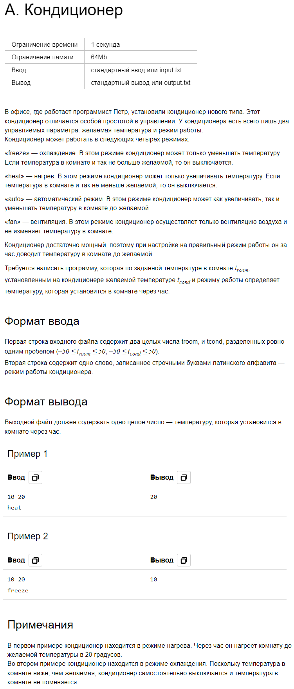
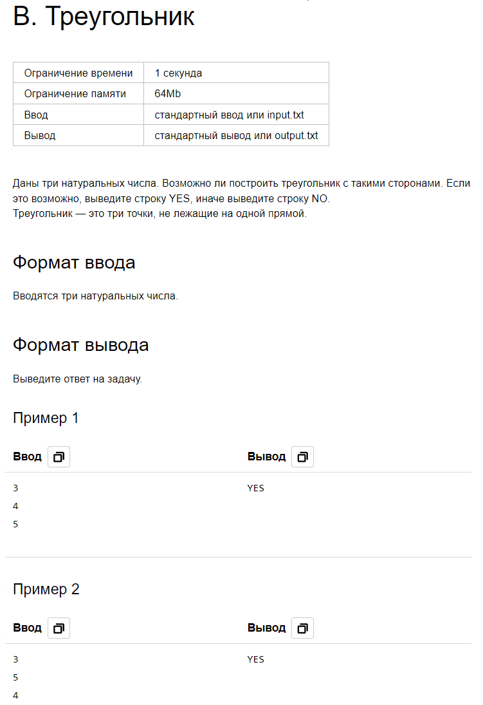
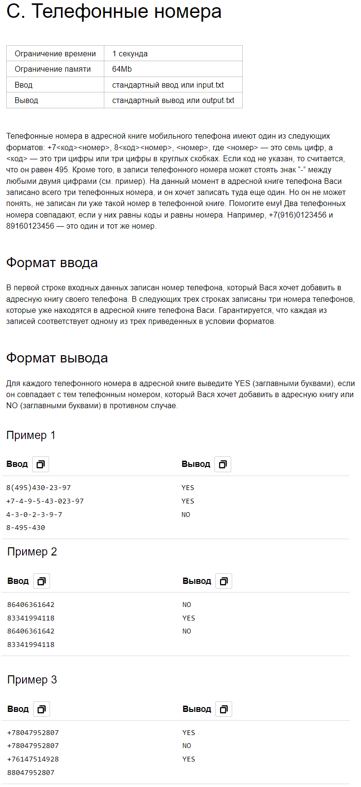
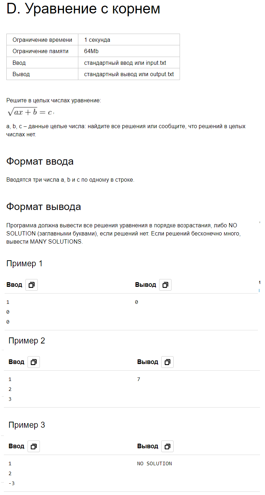
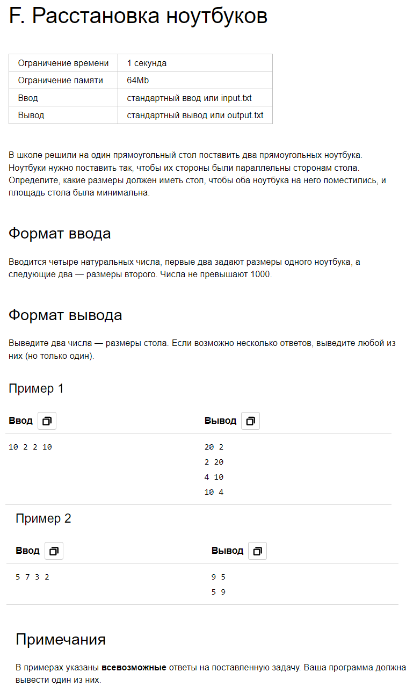
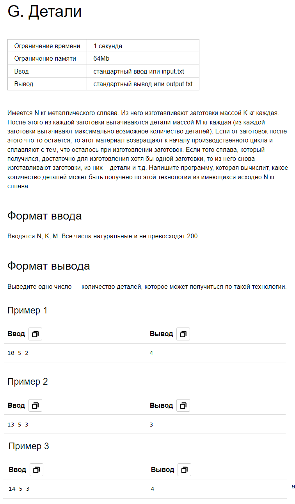

## Домашнее задание 1.


```python
troom, tcond = map(int, input().split())
mode = input()
t = troom

if mode == "freeze":
    if troom <= tcond:
        t = troom
    else:
        t = tcond
elif mode == "heat":
    if troom >= tcond:
        t = troom
    else:
        t = tcond
elif mode == "auto":
    t = tcond
elif mode == "fan":
    t = troom

print(t)
```



```python
a = int(input())
b = int(input())
c = int(input())
flag = "NO"

if a * b * c <= 0:
    flag = "NO"
elif a + b <= c or a + c <= b or b + c <= a:
    flag = "NO"
else:
    flag = "YES"
print(flag)
```


```python
numbers = ['', '', '', '']
numbers[0] = input()
numbers[1] = input()
numbers[2] = input()
numbers[3] = input()

for i in range(4):
    numbers[i] = numbers[i].replace('(', '')
    numbers[i] = numbers[i].replace(')', '')
    numbers[i] = numbers[i].replace('-', '')
    numbers[i] = numbers[i].replace('+', '')

    if len(numbers[i]) == 11 or len(numbers[i]) == 8:
        numbers[i] = numbers[i][1:]
    if len(numbers[i]) == 7:
        numbers[i] = '495' + numbers[i]

for i in range(1, 4):
    if numbers[0] == numbers[i]:
        print("YES")
    else:
        print("NO")

```


```python
a = int(input())
b = int(input())
c = int(input())
ansNO = "NO SOLUTION"
ansMANY = "MANY SOLUTIONS"

if c < 0:
    print(ansNO)
elif a == 0:
    if c * c - b == 0:
        print(ansMANY)
    else:
        print(ansNO)
else:
    if (c * c - b) % a == 0:
        print((c * c - b) // a)
    else:
        print(ansNO)
```

-


```python
a1, b1, a2, b2 = map(int, input().split())

if a1 < b1:
    a1, b1 = b1, a1
if a2 < b2:
    a2, b2 = b2, a2

S1 = (a1 + b2) * max(b1, a2)
S2 = (b1 + b2) * max(a1, a2)
S3 = (a2 + b1) * max(a1, b2)
S4 = (a2 + a1) * max(b1, b2)
S_min = min(S1, S2, S3, S4)

if S_min == S1:
    a_final = max(b1, a2)
    b_final = S1 // a_final
elif S_min == S2:
    a_final = max(a1, a2)
    b_final = S2 // a_final
elif S_min == S3:
    a_final = max(a1, b2)
    b_final = S3 // a_final
elif S_min == S4:
    a_final = max(b1, b2)
    b_final = S4 // a_final

print(a_final, b_final)
```


```python
N, K, M = map(int, input().split())
amount = 0
N_left = 0

while (N >= K or N_left > 0) and K >= M:
    N += N_left
    N_left = 0
    if N >= K:
        N -= K
        amount += K // M
        N_left += K % M

print(amount)
```

